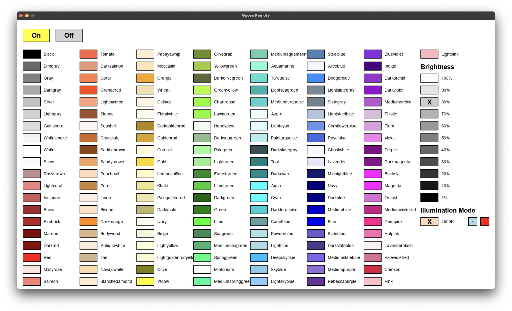

# Govee Remote

Controls Govee smart lights via the LAN API on supported devices.

## Installation
1. Enable [LAN Control](https://app-h5.govee.com/user-manual/wlan-guide) on your device in the Govee Home app
2. Install Python 3.12 (https://www.python.org/downloads/)
3. Install Poetry (https://python-poetry.org/docs/#installation)
4. Open `data/ip.txt` and update the IP to the local IP of your Govee device (autodetection coming soon)
5. Run `poetry install` from the project directory

## Running
Run `poetry run remote`

## Screenshot

